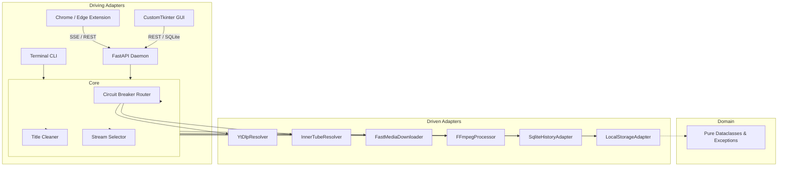

# OffStream

A resilient, local media downloader and browser companion built with strict Hexagonal Architecture.

[](https://github.com/ismaelUML/OffStream/actions/workflows/ci.yml)
[](tests/)
[-brightgreen.svg)](#code-metrics)
[](#code-metrics)
[-blueviolet.svg)](#architecture)
[](https://www.python.org/)
[](LICENSE)

---

## Why OffStream?

Online converters (`y2mate`, `savefrom`) are plagued with malicious redirects, spam ads, and aggressive CDN bandwidth throttling (~50 KB/s). Standard scripts and CLI tools, on the other hand, frequently lock up, leave zombie FFmpeg processes consuming CPU, flash unwanted CMD windows, and lack real-time visibility.

**OffStream** runs completely on your own machine as an asynchronous companion service:
- **Unthrottled parallel streaming**: Downloads 4 concurrent chunk streams to max out your connection line speed (completing downloads in 2–3 seconds).
- **Server-Sent Events (SSE)**: Delivers 60 FPS real-time progress updates directly from the download engine to the UI without network-saturating polling.
- **Embedded SQLite History**: Tracks video ID, title, channel, duration, timestamps, and destination paths via standard library `sqlite3`.
- **Searchable Desktop Library**: Instant search across your download history with live file integrity checks (`✓ En disco` vs. `⚠️ Archivo movido o eliminado`) and one-click playback (`os.startfile`).
- **Resilient Cookies Bypass**: Injects active local browser sessions (`Chrome`, `Firefox`, `Edge`, `Brave`) or `cookies.txt` to bypass bot challenges, age gates, and download high-bitrate YouTube Music audio—featuring automated fallback if Windows locks the cookie database.
- **Windows-Defensive Engineering**: Suppresses black console flashes via `CREATE_NO_WINDOW` and purges process trees on exit using `taskkill.exe /F /T /PID`.

---

## Quick Start

### 🚀 Standalone Portable Release (Zero Setup)
No Python installation or command-line required.
1. Download **`OffStream-Windows-Portable.zip`** from [Releases](https://github.com/ismaelUML/OffStream/releases).
2. Extract the folder anywhere on your computer.
3. Double-click **`OffStream.exe`** to start.

---

### 💻 Developer Setup
Requires **Python 3.11+** on Windows 10/11 (FFmpeg is automatically bundled via `imageio-ffmpeg`).

```bash
git clone https://github.com/ismaelUML/OffStream.git
cd OffStream

python -m venv venv
venv\Scripts\activate
pip install -r requirements.txt
```

### 2. Start the Local Daemon
```bash
python main.py
# Runs on http://127.0.0.1:8765
```

> [!TIP]
> For invisible background execution without an open terminal window, double-click `scripts/windows/start_silent.vbs` (or run `scripts/windows/install_autostart.bat` to launch on Windows boot).

---

## Usage

### 1. Browser Extension (Chrome / Edge / Brave)
1. Open `chrome://extensions/` and enable **Developer mode**.
2. Click **Load unpacked** and select the `clients/browser-extension/` directory.
3. Pin **OffStream** to your toolbar.
4. On any YouTube or YouTube Music video, click the toolbar icon: the active URL is detected automatically. Click **Video** or **Audio (MP3)**. Progress streams live via SSE.

### 2. Desktop GUI (CustomTkinter)
```bash
python main.py --gui
# or: python -m adapters.in_bound.gui
```
Or simply double-click `Start_OffStream.bat` (or `Launch_Dashboard.bat`).
- **Tab "⬇ Descargas"**: Paste any URL, select quality (1080p+, MP3, 720p), view live progress, and manage the daemon lifecycle.
- **Tab "📚 Biblioteca / Historial"**: Type to search through past downloads in real time. Click **▶ Reproducir** to launch in your default media player, or **📁 Carpeta** to highlight the file in Windows Explorer.

### 3. Command Line Interface (CLI)
```bash
# Download 1080p video with lossless remux
python main.py "https://www.youtube.com/watch?v=VIDEO_ID" -q 1080p

# Download audio converted directly to MP3 with embedded album art
python main.py -a "https://www.youtube.com/watch?v=VIDEO_ID"

# Use browser cookies to bypass age-gating or access YouTube Music bitrate
python main.py -a "https://music.youtube.com/watch?v=VIDEO_ID" --cookies-from-browser chrome

# Inspect stream metadata without downloading
python main.py -i "https://www.youtube.com/watch?v=VIDEO_ID"
```

All downloads are automatically sorted and organized in `Downloads/yt-global-dl/`:
- `music/`: Configured with Windows Explorer **Music** view template (`desktop.ini`), displaying artist, title, duration, and bitrates.
- `videos/`: Configured with Windows Explorer **Videos** view template (`desktop.ini`), displaying video resolution, duration, and dimensions.
- Embedded metadata tags (Title, Artist/Uploader) are injected into MP3/MP4 files for immediate playback compatibility in car stereos, iTunes, and mobile players.

---

## Architecture & Project Structure

OffStream follows strict **Hexagonal Architecture (Ports and Adapters)** principles to maintain high cohesion and absolute testability:

```text
yt-global-dl/
├── .github/
│   └── workflows/ci.yml           # Automated Windows CI (Pytest + Radon Rank A audit)
├── domain/                        # Pure models (dataclasses) & business exceptions (Zero deps)
├── ports/                         # Abstract Protocol interfaces (in_bound, out_bound)
├── core/                          # Domain orchestrators (DownloadManager, circuit breaker, etc.)
├── adapters/                      # Concrete technology drivers & driven components
│   ├── in_bound/                  # Driving adapters: cli.py, server.py, gui.py
│   └── out_bound/                 # Driven adapters: ytdlp, ffmpeg, sqlite, cookies, etc.
├── clients/
│   └── browser-extension/         # Manifest V3 extension (Chrome / Edge / Brave)
├── scripts/
│   ├── build_windows_exe.py       # Deterministic PyInstaller standalone bundler
│   ├── install_deps.py            # Hardened binary dependency installer
│   └── windows/                   # Platform background daemons & autostart automation
├── tests/                         # Pytest test suite (100% pass rate)
├── main.py                        # Unified CLI / Daemon / GUI bootstrapper
├── Build_Release.bat              # 1-Click compiler for standalone OffStream.exe
├── Start_OffStream.bat            # Fail-safe 1-Click desktop launcher (auto-healing & Python detect)
└── Launch_Dashboard.bat           # Desktop dashboard launcher
```



- **Domain (`domain/`)**: Pure Python standard library dataclasses (`DownloadJob`, `DownloadRecord`, `StreamFormat`). Zero external imports.
- **Ports (`ports/`)**: Interfaces defined using `typing.Protocol` (`StreamResolverPort`, `MediaDownloaderPort`, `MediaProcessorPort`, `StoragePort`, `HistoryRepositoryPort`).
- **Core (`core/`)**: Orchestration services. Enforces Little's Law with bounded concurrency (3 parallel workers, max 25 queue capacity), socket cancellation hooks, and circuit-breaker failover.
- **Adapters (`adapters/`)**: Concrete implementations (FastAPI server, CLI parser, Desktop GUI, SQLite history database, yt-dlp direct downloader, imageio FFmpeg wrapper).
- **Clients (`clients/`)**: Browser companion extensions interacting through the local HTTP/SSE interface.

---

## Code Metrics

Code quality is monitored using [Radon](https://radon.readthedocs.io/):

| Layer | Modules | Average CC | Maximum CC | Maintainability Index |
|---|---|:---:|:---:|:---:|
| **Domain** | `models.py`, `exceptions.py` | **1.04** | 2 | **100.0 (Rank A)** |
| **Ports** | `in_bound.py`, `out_bound.py` | **1.22** | 2 | **100.0 (Rank A)** |
| **Core** | `download_manager.py`, `circuit_breaker.py`, `stream_selector.py`, `title_cleaner.py`, `url_parser.py` | **2.97** | 5 | **78.9 (Rank A)** |
| **Adapters** | `server.py`, `cli.py`, `gui.py`, `sqlite_history.py`, `fast_downloader.py`, `ytdlp_resolver.py`, `cookies_helper.py`, `ffmpeg_processor.py` | **2.39** | 5 | **63.4 (Rank A)** |
| **Bootstrapper** | `main.py` | **3.00** | 4 | **72.0 (Rank A)** |
| **Overall Production** | **All 26 Python Modules** | **2.19 (Rank A)** | **5 (Rank A)** | **100% Rank A** |

> [!NOTE]
> Every single production function has a Cyclomatic Complexity $\le 5$, adhering to strict Single Responsibility and Clean Code standards.

---

## Tests

Run the full automated test suite (44 unit and integration tests):

```bash
python -m pytest tests/ -v
```

Run static complexity and maintainability audits:

```bash
python -m radon cc domain ports core adapters main.py -s -a
python -m radon mi domain ports core adapters main.py -s
```

---

## Disclaimer

This software is designed for personal media backup, local caching, and educational analysis only. Users are responsible for complying with local copyright laws and third-party terms of service.

---

## License

Released under the [MIT License](LICENSE).
